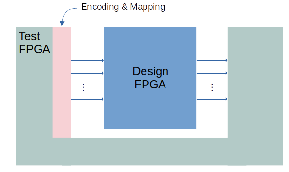

COmbinational Intelligent Networks
==================================

COIN is a new approach to the training of weightless neural networks (WNNs) using the BNN framework.
It is designed to be efficient for ASIC, FPGA, and eFPGA implementations with the following advantages:

- WNN training using backpropagation.
- Enhanced model accuracy and energy efficiency.
- Implementation using only logic functions.
- Efficient hardware implementations.
- A new encoding technique to be used with WNNs that reduces resources utilization
- This open-source tool chain to automatically generate COIN models from training to RTL.

# Training and hardware generation flow.

COIN is an improvement on LogicWiSARD networks [1](#publications). It consists of training a LogicWiSARD model, converting it into a BNN – Binary Neural Network, training the BNN with backpropagation, and converting the trained BNN into a new WNN model named COIN. The training and hardware generation flow is depicted in the following figure:


# Installation


To run the COIN project, you need to follow these installation steps:

## Install Conda

Conda is a package and environment management system that allows you to easily install and manage software dependencies. Follow the instructions below to install Conda:

### On Windows

Visit the Conda website: [https://docs.conda.io/projects/conda/en/latest/user-guide/install/windows.html](https://docs.conda.io/projects/conda/en/latest/user-guide/install/windows.html)

### On macOS

Visit the Conda website: [https://docs.conda.io/projects/conda/en/latest/user-guide/install/macos.html](https://docs.conda.io/projects/conda/en/latest/user-guide/install/macos.html)

### On Linux

Visit the Conda website: [https://docs.conda.io/projects/conda/en/latest/user-guide/install/linux.html](https://docs.conda.io/projects/conda/en/latest/user-guide/install/linux.html)

### Install requirements

1. Create and activate a Conda environment
2. Then, run the following command to install the dependencies using pip (Python package installer):
```
pip install -r requirements.txt
```

# Usage

## Training

COIN source codes are in `lib/` directory. Dataset specific codes must be in `<dataset_dir>/` directory.
This version comes with an implementation of MNIST dataset classification whose files are in `mnist/` directory.

From `mnist/` directory, run a simple COIN training for MNIST dataset as follows:

```
python ./run_single.py
```

This generates a LogicWiSARD model which afterwards is modified and trained as a COIN model. All the results are placed in the `coin/mnist/out` folder.
The configuration script `config.py` can be modified to produce the desired results.

This example trains a COIN model using address size of 16, thermometer resolution of 2, and 5 backpropagation epoches.
This humble configuration aims to cope with limited memory machines (8GB or less) and achives an accuracy in 95%-96% range. If you have enough memory and/or a GPU, change the thermometer resolution and the number of epoches on the configuration script to increase accuracy.


## RTL generation

To generate RTL and simulation files out of a COIN model, run from mnist folder:

> ../lib/gen_rtl.py mnist ../mnist/out/<coin_model.pkl> 1

where <coin_model.pkl> is the file name of the model generated during training. The last parameter is to indicate if the model to be generated is LogicWiSARD (0) or COIN (1). The files are created at out/rtl/lw or out/rtl/coin respectively.

## Simulation

Two testbench are generated for COIN, one for parallel input and one for serial input. Look at the files wisard_parallel.srclst and wisard_serial.srclst to see the list of files used for each simulation. To run the parallel simulation, you also need to define the constant WISARD_PARALLEL_INPUT.

There are also .sh scripts to run the simulation using Cadence tools.

## FPGA Emulation and Chip Testing

We have developed an alternative simulation and emulation environment, which is a synthesizable tester module (wisard_tester.sv) that generates inputs to a COIN design and checks its outputs.

This module can be used to:

- Verify the normal operation of COIN
- Verify the test structures of the design
- Run gate simulation
- Run FPGA emulation using one or two FPGAs
- Run testing on the actual chip

When running the FPGA emulation, the following arrangement could be adopted:



The test set inputs are used to generate the inputs, but not all of it. This is because the tester needs a ROM memory for each input, which could be troublesome if thousands of inputs are considered. This could require a large amount of resources for either simulation or FPGA prototyping.

Also, the tester needs intermediate values of the COIN execution flow to test LUT outputs and to insert into the control logic through the multiplexer.

To use the tester, do the following steps:
- Generate COIN RTL and testbench files (using gen_rtl.py as explained above).
- Generate the LUT output files by running "../lib/wisard_lut_out_gen.py ../mnist/out/rtl/coin/"
- Set the number of test inputs N in the script "../lib/gen_test_mem.py" and run it. The files rom_tester_in.sv and rom_tester_lo.sv will be generated in the main coin folder. Move them to your RTL folder.
- Edit wisard_tester.sv in the "EDIT ME" sections to provide the design parameters. Details in the comments.
- Edit tb_wisard_tester.sv in the "EDIT ME" sections if you're running simulation.
- Use the file wisard_tester.srclst for the source list.
- Run the simulation or the FPGA synthesis

Failure or success are indicated in the simulation console and the LED signals available in the wisard_tester module. They are: led_running, led_success, led_prediction_error, and led_lut_error.


# Creating a new classifier

One can use the `mnist/` folder as a starting point for a new classifier implementation. All scripts in this folder should be 
adapted to new datasets or classification problems.

# Publications

[1] I. D. S. Miranda et al., “Logicwisard: Memoryless synthesis of weightless neural networks,” in 2022 IEEE 33rd International Conference on Application-specific Systems, Architectures and Processors (ASAP), 2022

# Collaborators

- Igor D. S. Miranda
- Aman Arora
- Zachary Susskind
- Josias S. A. Souza
- Mugdha P. Jadhao
- Luis A. Q. Villon
- Diego L. C. Dutra
- Priscila M. V. Lima
- Felipe M. G. França
- Mauricio Breternitz Jr.
- Lizy K. John
